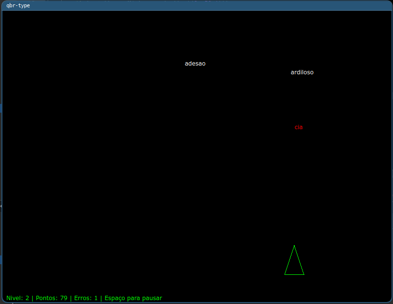

# qbr-type
- Inspired by Z-Type game made by Dominic Szablewski (https://phoboslab.org)
- Made entirely using Qt's Painter, no external libraries. 

## How to play
- Open CMakeLists.txt on Qt-Creator (Qt6 or Qt5), compile and have fun.

## TODO
- Add write per second.
- Fix #FIXME
- Prioritize lower index, since it is closer to the bottom of the screen.
- Clean CMakeLists, Debug/Release/Etc
